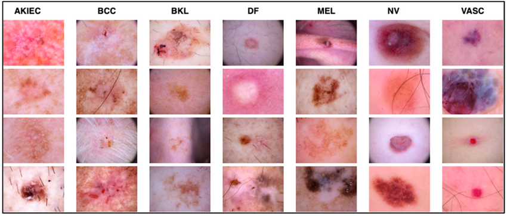

# Aplicaciones-Clínicas-en-Señales-e-Imágenes---Grupo-2
Proyecto: Detection of Cancerous Skin Lesions Through Deep Learning

Integrantes:
- Maria Cristina Orihuela
- Jesus Juarez
- Luis Chirre
- Gabriel Marcos
- Sergio Moreno
